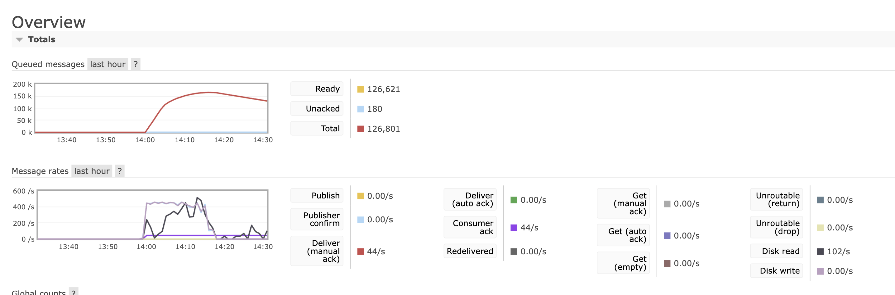
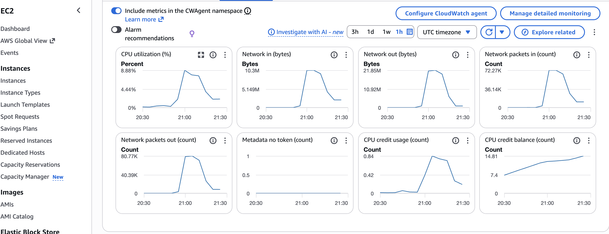
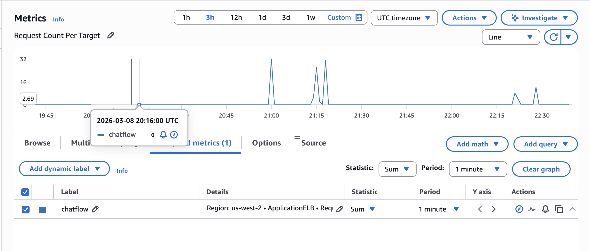
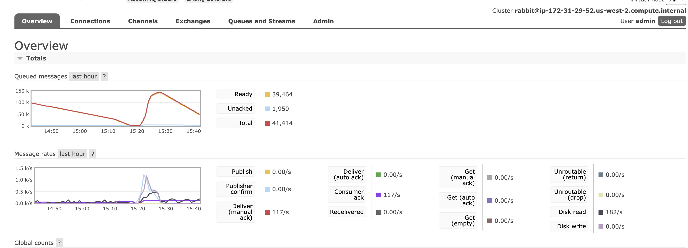
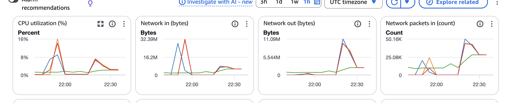

# CS6650 Assignment 2: Message Distribution and Queue Management

**Student Name:** Xuefeng Li 
**Date:** March 8, 2026  
**Repository:** https://github.com/yimdx/ChatFlow

---
## 0. Github
Create new folders:

- /server-v2 - Updated server with queue integration
- /consumer - Consumer application
- /deployment - ALB configuration, scripts
- /monitoring - Monitoring scripts and tools

## 1. System Architecture

### 1.1 Message Flow Sequence

**Step-by-Step Message Delivery:**

1. **Client → Server (WebSocket)**
   - Client sends message via WebSocket connection
   - Message format: `{"userId": "user1", "message": "Hello", "roomId": "room1"}`

2. **Server → RabbitMQ (AMQP)**
   - Server receives message and constructs QueueMessage
   - Publishes to `chat.exchange` with routing key `room.{roomId}`
   - Message routed to corresponding room queue (e.g., `room.1`)

3. **RabbitMQ → Consumer**
   - Consumer threads poll respective room queues
   - Pull message with manual acknowledgment
   - Process message for broadcast

4. **Consumer → Servers (HTTP POST)**
   - Consumer sends HTTP POST to `/broadcast` on ALL servers
   - Endpoint: `http://server1:8082/broadcast`, `http://server2:8082/broadcast`, etc.
   - Payload: JSON QueueMessage

5. **Server → Clients (WebSocket)**
   - Each server receives broadcast request
   - Looks up room participants
   - Broadcasts message to all connected WebSocket clients in that room

**Sequence Diagram:**

```
Client    ALB    Server-1,.. RabbitMQ  Consumer  Servers
  │        │        │         │         │         │
  ├─(WS)──>│        │         │         │         │ 1. Send message
  │        ├───────>│         │         │         │ 2. Route to server
  │        │        ├─(AMQP)─>│         │         │ 3. Publish to queue
  │        │        │         ├────────>│         │ 4. Consumer pulls
  │        │        │         │         ├─(HTTP)─>│ 5. Broadcast to all servers
  │        │        │<────────┼─────────┤         │
  │<───────┼────────┤         │         │         │ 6. WebSocket broadcast
  │        │        │         │         │         │
  Other_Client  ◄───┼─────────┼─────────┼─────────┤ 7. Receive in same room
```

### 1.2 Routing Design

**Routing Pattern:**
```
Message with routing key "room.5" → Routed to → room.5 queue
Message with routing key "room.12" → Routed to → room.12 queue
```

**Design Decision: How to Broadcast**

**HTTP Broadcast Solution:**
- Consumer makes direct HTTP POST requests to all servers
- Decouples message consumption from broadcast distribution
- Eliminates channel pool contention
- Simple, reliable, and performant
- HTTP client timeout controls ensure non-blocking behavior

### 1.3 Consumer Threading Model

**Thread Pool Architecture:**

```
Consumer Application
├── Main Thread (Coordination)
├── Consumer Thread Pool (20 threads)
│   ├── Thread 1  → Handles room.1
│   ├── ...
│   └── Thread 20 → Handles room.20
```

**Key Design Elements:**

1. **Fair Room Distribution**
   - Each thread assigned exactly one room
   - No overlap or contention between threads
   - Deterministic mapping: Thread N handles room.N

2. **Message Processing Pipeline**
   ```
   Pull from Queue → Deserialize JSON → Broadcast to Servers → ACK Message
   ```

3. **Thread Safety**
   - Each thread has its own RabbitMQ channel
   - No shared mutable state between threads
   - HTTP client is thread-safe (java.net.http.HttpClient)

4. **Configuration**
   - Thread count: Configurable via `CONSUMER_THREAD_COUNT` (default: 20)
   - Prefetch count: 1 per consumer (QoS setting)
   - Acknowledgment: Manual after successful broadcast


---

## 2. Implementation Details


### 2.1 Key Components

**Server Components:**

1. **Main.java** - Application entry point
   - Initializes WebSocket server (port 8081)
   - Initializes health check server (port 8080)
   - Initializes HTTP broadcast server (port 8082)
   - Sets up RabbitMQ connection and channel pool

2. **WebSocketServer.java** - WebSocket handler
   - Manages client connections
   - Routes messages to RabbitMQ
   - Handles room join/leave events
   - Broadcasts messages to room participants

3. **RoomManager.java** - Room state management
   - Tracks active rooms and participants
   - Thread-safe with ConcurrentHashMap
   - Manages user sessions

4. **QueuePublisher.java** - RabbitMQ publisher
   - Channel pooling (20 channels)
   - Publisher confirms for reliability
   - Publishes to room-specific queues

5. **BroadcastServer.java** - HTTP broadcast endpoint
   - Listens on port 8082
   - Receives POST /broadcast requests
   - Deserializes and broadcasts to room

**Consumer Components:**

1. **Main.java** - Consumer orchestration
   - Creates thread pool for consumers
   - Distributes rooms across threads
   - Handles graceful shutdown

2. **MessageConsumerThread.java** - Consumer worker
   - Pulls messages from assigned room queue
   - Broadcasts to all servers via HTTP
   - Manual acknowledgment after success

3. **BroadcastHelper.java** - HTTP client
   - Thread-safe HTTP client
   - Timeout configuration
   - Error handling and logging

### 2.2 Failure Handling Strategies

**1. Server Failure:**
- **Detection:** ALB health checks fail after 3 consecutive failures (15 seconds)
- **Response:** ALB removes server from target group
- **Recovery:** Server auto-rejoins when health checks pass

**2. RabbitMQ Connection Failure:**
- **Detection:** Connection loss exception
- **Retry Logic:** Exponential backoff (1s, 2s, 4s, 8s)

**3. Consumer Failure:**
- **Detection:** Thread exception or process crash
- **Response:** Message not ACKed, returns to queue
- **Recovery:** Restart consumer process manually or via supervisor

**4. HTTP Broadcast Timeout:**
- **Detection:** HTTP client timeout (3 seconds)
- **Retry:** No retry (at-least-once delivery acceptable)

**5. WebSocket Connection Loss:**
- **Detection:** Connection closed event
- **Cleanup:** Session removed from RoomManager
- **Client:** Client must reconnect and rejoin room


---

## 3. Test Results

### 3.1 Test Environment

**Test Configuration:**
- **Total Messages:** 500,000
- **Number of Users:** 1,000
- **Rooms:** 20
- **Client Threads:** 64 (optimal found through testing)
- **Consumer Threads:** 20

### 3.2 Single Instance Performance

**Test Setup:**
- 1 server instance
- Direct connection (no ALB)
- RabbitMQ on separate instance
- Consumer on separate instance

**Results:**

```
============================================================
Test Summary - Single Instance
============================================================

14:18:55.931 [main] INFO  cs6650.assignment1.Main - ========================================
14:18:55.931 [main] INFO  cs6650.assignment1.Main - BASIC PERFORMANCE RESULTS
14:18:55.931 [main] INFO  cs6650.assignment1.Main - ========================================
14:18:55.931 [main] INFO  cs6650.assignment1.Main - 1. Successful messages sent: 367414
14:18:55.931 [main] INFO  cs6650.assignment1.Main - 2. Failed messages: 55747
14:18:55.931 [main] INFO  cs6650.assignment1.Main - 3. Total runtime: 1177197 ms (1177.197 seconds)
14:18:55.932 [main] INFO  cs6650.assignment1.Main -    - Warmup phase: 73499 ms
14:18:55.932 [main] INFO  cs6650.assignment1.Main -    - Main phase: 1099620 ms
14:18:55.932 [main] INFO  cs6650.assignment1.Main - 4. Overall throughput: 424.73774567893054 messages/second
14:18:55.932 [main] INFO  cs6650.assignment1.Main -    - Warmup throughput: 435.38007319827483 messages/second
14:18:55.932 [main] INFO  cs6650.assignment1.Main -    - Main phase throughput: 425.60157145195615 messages/second
14:18:55.933 [main] INFO  cs6650.assignment1.Main - 5. Connection statistics:
14:18:55.933 [main] INFO  cs6650.assignment1.Main -    - Total persistent connections: 96
14:18:55.933 [main] INFO  cs6650.assignment1.Main -    - Reconnections: 0
14:18:55.933 [main] INFO  cs6650.assignment1.Main - ========================================
14:18:55.933 [main] INFO  cs6650.assignment1.Main - 
Performing statistical analysis...
14:18:55.947 [main] INFO  c.a.util.PerformanceAnalyzer - Analyzing metrics from: results/metrics_20260308_135918.csv
14:18:56.280 [main] INFO  c.a.util.PerformanceAnalyzer - Analysis completed

========================================
STATISTICAL ANALYSIS
========================================
Total Messages: 499306
Mean Response Time: 112.05 ms
Median Response Time: 33.00 ms
95th Percentile: 417.00 ms
99th Percentile: 707.00 ms
Min Response Time: 0 ms
Max Response Time: 1008 ms

Message Type Distribution:
  JOIN: 25099 (5.0%)
  LEAVE: 24866 (5.0%)
  TEXT: 449341 (90.0%)

Message Count Per Room:
  Room 1: 15602 messages
  Room 2: 8310 messages
  Room 3: 38529 messages
  Room 4: 16602 messages
  Room 5: 8292 messages
  Room 6: 36478 messages
  Room 7: 8310 messages
  Room 8: 2000 messages
  Room 9: 44842 messages
  Room 10: 14620 messages
  Room 11: 18602 messages
  Room 12: 52116 messages
  Room 13: 47785 messages
  Room 14: 43801 messages
  Room 15: 23894 messages
  Room 16: 23911 messages
  Room 17: 38532 messages
  Room 18: 23876 messages
  Room 19: 32204 messages
  Room 20: 1000 messages

Throughput Per Room:
  Room 1: 13.31 messages/second
  Room 2: 8.92 messages/second
  Room 3: 32.91 messages/second
  Room 4: 14.18 messages/second
  Room 5: 7.08 messages/second
  Room 6: 33.18 messages/second
  Room 7: 8.69 messages/second
  Room 8: 27.76 messages/second
  Room 9: 38.23 messages/second
  Room 10: 16.67 messages/second
  Room 11: 15.86 messages/second
  Room 12: 44.44 messages/second
  Room 13: 40.75 messages/second
  Room 14: 39.84 messages/second
  Room 15: 20.38 messages/second
  Room 16: 20.39 messages/second
  Room 17: 32.86 messages/second
  Room 18: 20.36 messages/second
  Room 19: 27.48 messages/second
  Room 20: 16.86 messages/second
========================================
```

**RabbitMQ Queue Metrics:**



**System Resource Usage:**




### 3.3 Load Balanced Performance (4 Instances)

**Test Setup:**
- 4 server instances behind ALB
- Same RabbitMQ and consumer instances
- Extended test with 500,000 messages (stress test)


```
15:29:16.466 [main] INFO  cs6650.assignment1.Main - ========================================
15:29:16.466 [main] INFO  cs6650.assignment1.Main - BASIC PERFORMANCE RESULTS
15:29:16.466 [main] INFO  cs6650.assignment1.Main - ========================================
15:29:16.466 [main] INFO  cs6650.assignment1.Main - 1. Successful messages sent: 223189
15:29:16.467 [main] INFO  cs6650.assignment1.Main - 2. Failed messages: 36507
15:29:16.467 [main] INFO  cs6650.assignment1.Main - 3. Total runtime: 502430 ms (502.43 seconds)
15:29:16.468 [main] INFO  cs6650.assignment1.Main -    - Warmup phase: 60270 ms
15:29:16.468 [main] INFO  cs6650.assignment1.Main -    - Main phase: 438069 ms
15:29:16.468 [main] INFO  cs6650.assignment1.Main - 4. Overall throughput: 995.1635053639313 messages/second
15:29:16.468 [main] INFO  cs6650.assignment1.Main -    - Warmup throughput: 530.9440849510536 messages/second
15:29:16.468 [main] INFO  cs6650.assignment1.Main -    - Main phase throughput: 1068.3248529341267 messages/second
15:29:16.468 [main] INFO  cs6650.assignment1.Main - 5. Connection statistics:
15:29:16.468 [main] INFO  cs6650.assignment1.Main -    - Total persistent connections: 96
15:29:16.468 [main] INFO  cs6650.assignment1.Main -    - Reconnections: 0
15:29:16.468 [main] INFO  cs6650.assignment1.Main - ========================================
15:29:16.468 [main] INFO  cs6650.assignment1.Main - 
Performing statistical analysis...
15:29:16.487 [main] INFO  c.a.util.PerformanceAnalyzer - Analyzing metrics from: results/metrics_20260308_152054.csv
15:29:16.761 [main] INFO  c.a.util.PerformanceAnalyzer - Analysis completed

========================================
STATISTICAL ANALYSIS
========================================
Total Messages: 375242
Mean Response Time: 29.08 ms
Median Response Time: 28.00 ms
95th Percentile: 70.00 ms
99th Percentile: 131.00 ms
Min Response Time: 0 ms
Max Response Time: 1003 ms

Message Type Distribution:
  JOIN: 18520 (4.9%)
  LEAVE: 18743 (5.0%)
  TEXT: 337979 (90.1%)

Message Count Per Room:
  Room 1: 23888 messages
  Room 2: 9297 messages
  Room 3: 8297 messages
  Room 4: 21887 messages
  Room 5: 30184 messages
  Room 6: 15592 messages
  Room 7: 14592 messages
  Room 8: 29183 messages
  Room 9: 14591 messages
  Room 10: 7297 messages
  Room 11: 4000 messages
  Room 12: 43776 messages
  Room 13: 2000 messages
  Room 14: 45776 messages
  Room 15: 22920 messages
  Room 16: 23888 messages
  Room 17: 9296 messages
  Room 18: 23889 messages
  Room 19: 16592 messages
  Room 20: 8297 messages

Throughput Per Room:
  Room 1: 47.97 messages/second
  Room 2: 18.71 messages/second
  Room 3: 16.68 messages/second
  Room 4: 50.01 messages/second
  Room 5: 60.63 messages/second
  Room 6: 31.43 messages/second
  Room 7: 33.32 messages/second
  Room 8: 66.64 messages/second
  Room 9: 33.32 messages/second
  Room 10: 16.69 messages/second
  Room 11: 132.53 messages/second
  Room 12: 99.96 messages/second
  Room 13: 62.51 messages/second
  Room 14: 91.92 messages/second
  Room 15: 46.08 messages/second
  Room 16: 48.10 messages/second
  Room 17: 18.78 messages/second
  Room 18: 48.07 messages/second
  Room 19: 33.33 messages/second
  Room 20: 16.67 messages/second
========================================
```






---

## 4. Configuration Files

### 4.1 Configuration Parameters

**Environment Variables:**

**Server:**
```bash
HEALTH_PORT=8080          # Health check endpoint
WEBSOCKET_PORT=8081       # WebSocket connections
BROADCAST_PORT=8082       # HTTP broadcast receiver
RABBITMQ_HOST=            # RabbitMQ server
RABBITMQ_PORT=5672        # AMQP port
SERVER_ID=server-1        # Unique server identifier
```

**Consumer:**
```bash
RABBITMQ_HOST=           # RabbitMQ server
RABBITMQ_PORT=5672        # AMQP port
CONSUMER_THREAD_COUNT=20  # Number of consumer threads
SERVER_URLS=http://server1:8082,http://server2:8082  # Target servers
```

**RabbitMQ:**
```bash
RABBITMQ_DEFAULT_USER=admin
RABBITMQ_DEFAULT_PASS=adminpassword
```

**AWS Application Load Balancer Setup:**

**Target Group Settings:**
- Protocol: HTTP
- Port: 8081 (WebSocket traffic)
- Health Check:
  - Path: `/health`
  - Protocol: HTTP
  - Port: 8080
  - Interval: 30 seconds
  - Timeout: 5 seconds
  - Healthy threshold: 2 consecutive successes
  - Unhealthy threshold: 3 consecutive failures

**Load Balancer Configuration:**
- Sticky Sessions: **Enabled** 
  - Duration: 1 hours
- Idle Timeout: 60 seconds
- Connection Draining: 300 seconds
- WebSocket Support: Enabled (HTTP/1.1 upgrade)

**Exchange Configuration:**
- **Name:** `chat.exchange`
- **Type:** Topic Exchange
- **Durable:** Yes
- **Auto-delete:** No

**Queue Configuration:**
- **Queues:** 20 queues (`room.1` through `room.20`)
- **Binding:** Each queue bound with routing key `room.{id}`
- **Properties:**
  - Durable: Yes
  - Exclusive: No
  - Auto-delete: No
  - Arguments: None (default limits)


### 4.2 Repository Structure

```
ChatFlow/
├── server-v2/              # WebSocket server with RabbitMQ integration
│   ├── src/main/java/
│   ├── pom.xml
│   └── README.md
├── consumer/               # Multi-threaded message consumer
│   ├── src/main/java/
│   ├── pom.xml
│   └── README.md
├── client-part1/          # Part 1 client (500K messages)
│   ├── src/main/java/
│   ├── pom.xml
│   └── README.md
├── client-part2/          # Part 2 client (enhanced)
│   ├── src/main/java/
│   ├── pom.xml
│   └── README.md
├── monitoring/            # Monitoring scripts (bash)
│   ├── monitor_rabbitmq.sh
│   ├── monitor_servers.sh
│   ├── analyze_metrics.sh
│   ├── run_monitoring.sh
│   └── README.md
├── deployment/            # Deployment scripts and configs
│   ├── deploy-server.sh
│   ├── deploy-consumer.sh
│   └── README.md
├── assignment2.md         # Submission checklist
├── SUBMISSION_REPORT.md   # This document
└── README.md              # Project overview
```